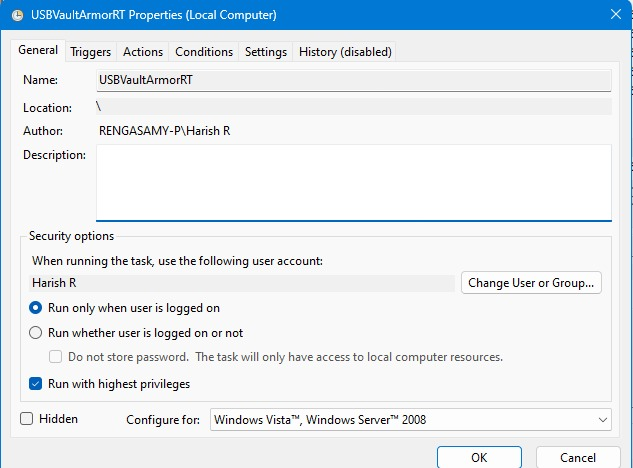
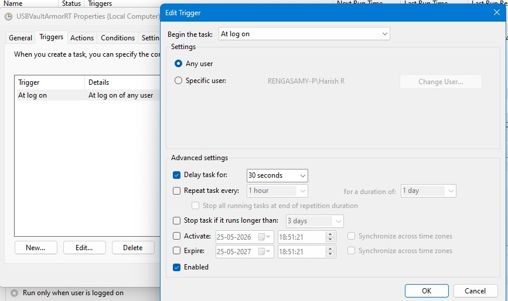
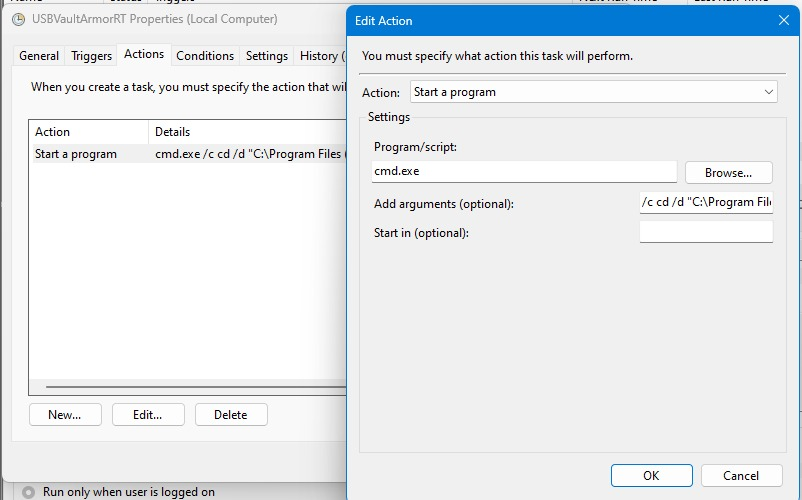
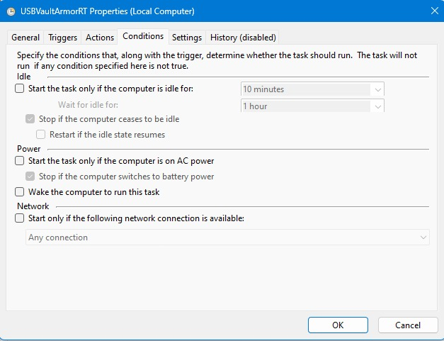
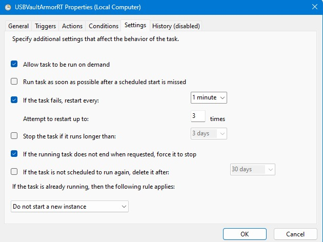

# Nexcryptix-RT - USB Endpoint Data Security System

  

## Installation :

## On Endpoint System
### Encryption Module :

1. Open `encryption_tool`
2. Run `Nexcryptix-RT_Installer.exe`
3. Complete the installation wizard
4. Launch Nexcryptix-RT

## On Extraction system (where data to be transfered securely to)
### Decryption Module :

1. Open `decryption_tool`
2. Run `Nexcryptix-RT_Decryptor_Installer.exe`
3. Complete the installation wizard
4. Launch Nexcryptix-RT Decryptor

## Usage :

### Encryption

1. Launch **Nexcryptix-RT**.
2. Insert a USB storage device.
3. Enter a password when prompted.
4. Device authentication and secure key generation will be completed automatically.
5. Copy or modify files on the USB drive.
6. Files will be automatically encrypted in real time and stored with the `.enc` extension.
7. Security events will be logged automatically for monitoring and auditing.

### Decryption

1. Launch **Nexcryptix-RT Decryptor**.
2. Insert the encrypted USB storage device.
3. Enter the password used during encryption.
4. The system will verify the device identity and authentication credentials.
5. Encrypted files will be restored to their original format.
6. Temporary security artifacts will be securely removed after successful decryption.

## Requirements :

- Windows 10 or Windows 11
- USB Storage Device
- Administrator Privileges (Recommended)

## Automatic Startup Configuration :

Nexcryptix-RT is configured to launch automatically after user login using Windows Task Scheduler, ensuring continuous USB endpoint protection without requiring manual startup.

### Task Scheduler Configuration : 

### Verify the Scheduled Task

1. Open **Task Scheduler**.
2. Navigate to **Task Scheduler Library**.
3. Search for:
   - `USBVaultArmorRT`
   or
   - `Nexcryptix-RT`
4. Open the task properties to view its startup and security settings.

### Purpose :

The scheduled task automatically launches Nexcryptix-RT during user logon, enabling:

- Continuous USB device monitoring
- Real-time file encryption
- Device authentication enforcement
- Security event logging
- Persistent endpoint protection

**General**
- Run with highest privileges
- Execute only when the user is logged on
- Enabled for automatic startup

**Trigger**
- Begin the task: At log on
- Applies to: Any user
- Startup delay: 30 seconds

**Action**
- Start Nexcryptix-RT automatically using a startup command

**Conditions**
- No idle, power, or network restrictions
- Designed for continuous monitoring operation

**Settings**
- Allow task to run on demand
- Automatically restart on failure
- Prevent multiple instances from running simultaneously

### Purpose :

This configuration ensures that:

- USB monitoring starts automatically after login
- Real-time file encryption remains active
- USB authentication is continuously enforced
- Security event logging operates without interruption
- Endpoint protection remains active throughout the user session

## Set or Keep as like as in the images : 

     
     
     
     
     

  
